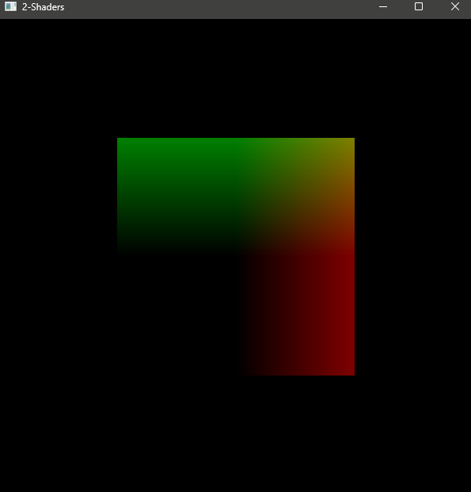
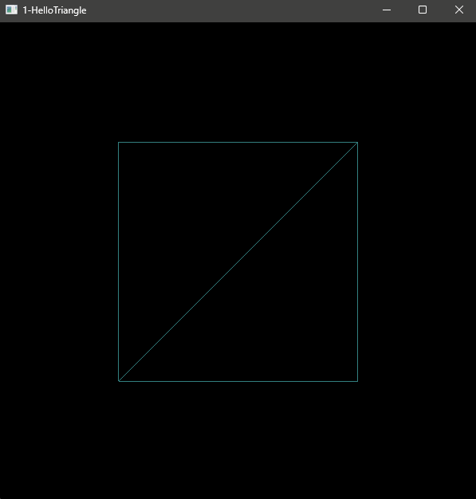

Shaders set the color to the vertex pos of te square, and a uniform dynamically changing the colors according
to allapsed time.

My first triangle(s)

#### Still at the very basics of graphics programming and C++.

Using this as a __means to track__ my learning progress.

I do try to modify and play with their (resources i use) code as much as possible, and try to focus on
writing code to a high standard, however, it is in my best interest to absorb the math and focus
on getting things working.

That said, there are many things that need to be learned in order to do this properly, so
I am just figuring it out as I go. Seems that there aren't clear ways on how everyone learns
GP, so learning bit by bit is a win.

Thanks for checking it out :)

### Resources i use:

Websites:
[learncpp.com](learncpp.com),
[learnopengl.com](learnopengl.com) (A book as well)

Books:
[Fundamentals of Computer Graphics](https://www.cs.cornell.edu/~srm/fcg3/) by: Steve Marschner and Peter Shirley
